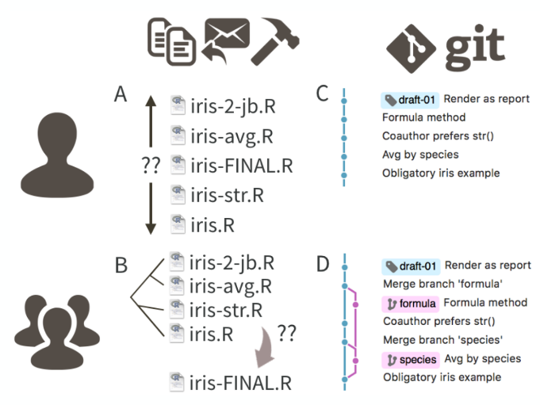
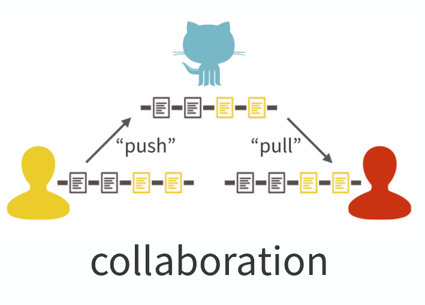
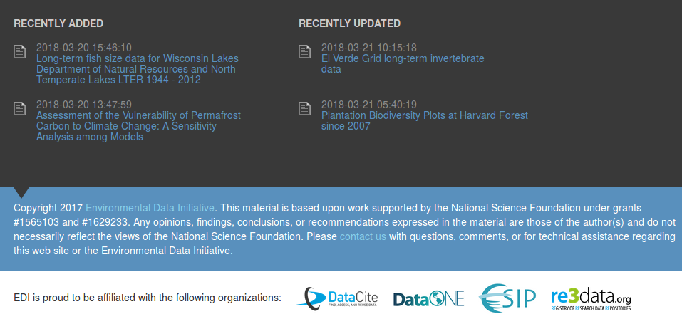

```{r setup, include=FALSE}
options(htmltools.dir.version = FALSE)

```

let us clarify what we mean by reproducibility...

* Replication is the cornerstone of scientific research, with consistent findings from independent investigators the primary means by which scientific evidence accumulates for or against a hypothesis. 
* The **replicability** of a study is related to the chance that an independent experiment targeting the same scientific question will produce a result consistent with the original study. 
* Recently, a variation of this concept, referred to as reproducibility, has emerged as a key minimum acceptable standard, especially for heavily computational research. 
* **Reproducibility is defined as the ability to recompute data analytic results, given an observed data set and knowledge of the data analysis pipeline.** 
* Replicability and reproducibility are two foundational characteristics of a successful scientific research enterprise. 

.footnote[Peng 2015. The reproducibility crisis in science: A statistical counterattack. 10.1111/j.1740-9713.2015.00827.x]


---

a crisis...


---

Duke cancer...

.pull-left[
  
]

.pull-right[
  
]


---

herndon on Reinhart and Rogoff


---

Cornell

.pull-left[
  
]

.pull-right[
  
]


---

git flow 




---

git collaboration




---

.h1[reproducability, for scientific reasons]

.large[given your data, someone else can reproduce your exact results]

* increased trustworthiness
* more rigorous, reliable science
* learning more from one another's work

"Science should be 'show me', not 'trust me'; it should be 'help me if you can', not 'catch me if you can'."

-- Philip B. Stark, <a href="https://www.nature.com/articles/d41586-018-05256-0" target="_blank">Nature 2018</a>
  
  
.footnote[Jennifer L. Thompson bit.ly/jlt-rmed2018]


---

reproducibility, for personal reasons

* "Did I mention that subjects with IDs > 100 are actually kangaroos and should be excluded?"
* "I won the lottery; now my coworker is taking over"
* "Journal reviews back after 8 months! Time for revisions!"
* "How does that patient have 15 months of treatment when we only followed people for 12 months?"
  
.footnote[Jennifer L. Thompson bit.ly/jlt-rmed2018]


---

reproducibility, for personal reasons

* "Did I mention that subjects with IDs > 100 are actually kangaroos and should be excluded?"
* "I won the lottery; now my coworker is taking over"
* "Journal reviews back after 8 months! Time for revisions!"
* "How does that patient have 15 months of treatment when we only followed people for 12 months?"
  
.footnote[Jennifer L. Thompson bit.ly/jlt-rmed2018]


---

plan ahead to live your best (research) life

"It's not thinking, 'This is easiest for myself right now.' It's thinking, 'When I'm working on this next week, next month, right before I graduate — how do I set myself up so that it's easier later?'

<a href="https://www.nature.com/articles/d41586-018-05256-0" target="_blank"> -- Julia Stewart Lowndes in "A toolkit for data transparency takes shape," Nature 2018</a>
  
  
.footnote[Jennifer L. Thompson bit.ly/jlt-rmed2018]


---

research data workflow: this is your world (or it will be soon)


.footnote[modified from Jenny Bryan’s UBC Stat 545 course (http://stat545.com/) who adapted it from Roger Peng (biostat.jhsph.edu/~rpeng/)]


---

* how do you keep that up-to-date?
* what if something changes, what if something needs to be redone - how do you manage that?
* why do the results in table 1 not seem to correspond to the results in figure 1?
* why were those particular samples omitted?
* where did I get these data?
* how did I make that figure?

**basically, if the thought of redoing your analyses is terrifying then you are doing it wrong (paraphrasing Jenny Bryan)**


---

research data workflow: this is your world (or it will be soon) .light-blue[now add to that publishing your data and code]


.footnote[modified from Jenny Bryan’s UBC Stat 545 course (http://stat545.com/) who adapted it from Roger Peng (biostat.jhsph.edu/~rpeng/)]


---
<!-- this starts the metadata + publishing lecture -->

# why publish data

* big picture
  + increasingly a requirement
  + advancement of science
  
* researcher perspective
  + papers with publicly available data receive a higher number of citations than similar studies lacking available data<sup>1</sup>
  + data sharing is associated with higher productivity<sup>1</sup>
  + <a href="https://portal.lternet.edu/nis/mapbrowse?packageid=knb-lter-cap.621.1" target="_blank">a citeable product</a>
  

.footnote[<sup>1</sup>Marwick et al. 2017. https://doi.org/10.7287/peerj.preprints.3192v1]

---

.pull-left[
  
]

.pull-right[

"The climate scientists at the centre of a media storm over leaked emails were yesterday cleared of accusations that they fudged their results and silenced critics, but a review found they had failed to be open enough about their work."
]

.footnote[https://nceas.github.io/crescynt-training/]


---

# concerns about sharing data

most common concerns can be addressed *with metadata*

.pull-left[
.center[**concern**]

<hr>

* inappropriate use due to misunderstanding of research purpose or parameters

* security and confidentiality of sensitive data

* lack of acknowledgement / credit

]

.pull-right[
.center[**solution**]

<hr>

* provide rich abstract, purpose, use constraints, and supplemental information

* use constraints to specify who may access the data and how

* specify a required data citation within the use constraints

]

.footnote[https://www.dataone.org/education-modules]


---

<br>
<br>
<br>

**"Without clear instructions, many researchers struggle to avoid chaos in their file structures, and so are understandably reluctant to expose their workflow for others to see.  This may be one of the reasons that so many requests for details about method, including requests for data and code, are turned down or go unanswered (Collberg & Proebsting 2016)."**

.footnote[Marwick et al. 2017. https://doi.org/10.7287/peerj.preprints.3192v1]


---

# what do we mean by data repository?

```{r echo=FALSE}
dataRepo <- data.frame(
  system = c("Google Drive", "GitHub", "University Server", "KNB*"),
  `long term` = c("maybe", "yes", "maybe", "yes"),
  versioned = c("maybe", "yes", "no", "yes"),
  citable = c("no", "no", "no", "yes"),
  discoverable = c("no", "no", "maybe", "yes")
)

knitr::kable(dataRepo, format = "html")
```

<small>
  *KNB (the Knowledge Network for Biocomplexity) is an international repository intended to facilitate ecological and environmental research
</small>

.footnote[https://nceas.github.io/crescynt-training/]


---

# where to publish?

.center[

]

is awesome but I would start with...
* institutional resources
* lab, colleagues
* conferences

---

# metadata standards: there are a lot


---

# metadata standards: what is a standard?

standards provides a structure to describe data with:
- common terms to allow consistency between records
- common definitions for easier interpretation
- common language for ease of communication
- common structure to quickly locate information

in search and retrieval, standards provide:
- documentation structure in a reliable and predictable format for computer interpretation
- a uniform summary description of the dataset

<!-- <p style="color:#00BFFF">...like a blueprint for the structure of information</p> -->

.footnote[https://www.dataone.org/education-modules]


---

# metadata standards: a blueprint

*example for a house*

.pull-left[

house:<br>
&nbsp;parcel_number:<br>
&nbsp;roof:<br>
&nbsp;&nbsp;type: shingle, shake, tile<br>
&nbsp;&nbsp;color:<br>
&nbsp;wall:<br>
&nbsp;&nbsp;exterior_wall:<br>
&nbsp;&nbsp;&nbsp;type: block, vinyl, stucco<br>
&nbsp;&nbsp;&nbsp;color:<br>
&nbsp;&nbsp;interior_wall:<br>
&nbsp;&nbsp;&nbsp;color:<br>

]

.pull-right[

```xml
<house>
  <parcel_number>45.658</parcel_number>
  <roof>
    <type>tile</type>
    <color>rustic red</color>
  </roof>
  <wall>
    <exterior_wall>
      <type>block</type>
      <color>swiss coffee</color>
    </exterior_wall>
    <interior_wall>
      <color>almond butter</color>
    </interior_wall>
 </wall>
</house>
```
]


---

# metadata standards: a blueprint

*example for ecological data*

```xml
<attribute>
  <attributeName>stem_diameter</attributeName>
  <attributeDefinition>stem diameter</attributeDefinition>
  <storageType>float</storageType>
  <measurementScale>
    <ratio>
      <unit>
        <standardUnit>centimeter</standardUnit>
      </unit>
      <numericDomain>
        <numberType>real</numberType>
      </numericDomain>
    </ratio>
  </measurementScale>
  <missingValueCode>
    <code>NA</code>
    <codeExplanation>missing value</codeExplanation>
  </missingValueCode>
</attribute>
```


---

# metadata: the who, what, why, where, when

- principal investigator
- funding sources
- data collector/producer
- project description
- sample and sampling procedures
- weighting
- substantive, temporal, and geographic coverage of the data collection
- data source(s)
- unit(s) of analysis/observation
- variables
- technical information on files
- data collection instruments

.footnote[adapted from ICPSR by Brianna Marshall from Metadata for Research Data]


---

<br>
<br>
<br>

**"data without the contextual information needed to interpret it (and ultimately reproduce the results) is useless"**

.footnote[from Metadata for Research Data by Brianna Marshall]


---

# what makes good metatadata?

- consistency with commonly used fields, e.g., YYYY-MM-DD
- use a standard vocubulary
- spell out acronyms
- provide all the critical information for: *identification; entities and attributes; data quality; data lineage; access, use, and liability constraints; accessing the data; spatial reference*
- complete title: who, what, when, where, and scale
- be specific, and quantify where possible
- use descriptive and clear writing
- fully document geographic locations
- use keywords wisely (use a thesausus when possible)
- detail, there is no such thing as too much!
- remember that a computer will read this:
  + avoid special characters
  + avoid tabs, indents, carriage returns
  + copy from a text file (not a file with rich text like Word or RTF)


.footnote[https://www.dataone.org/education-modules]

---

# a special note about titles




---

# orcid

.center[

]

[orcid.org](https://orcid.org/)